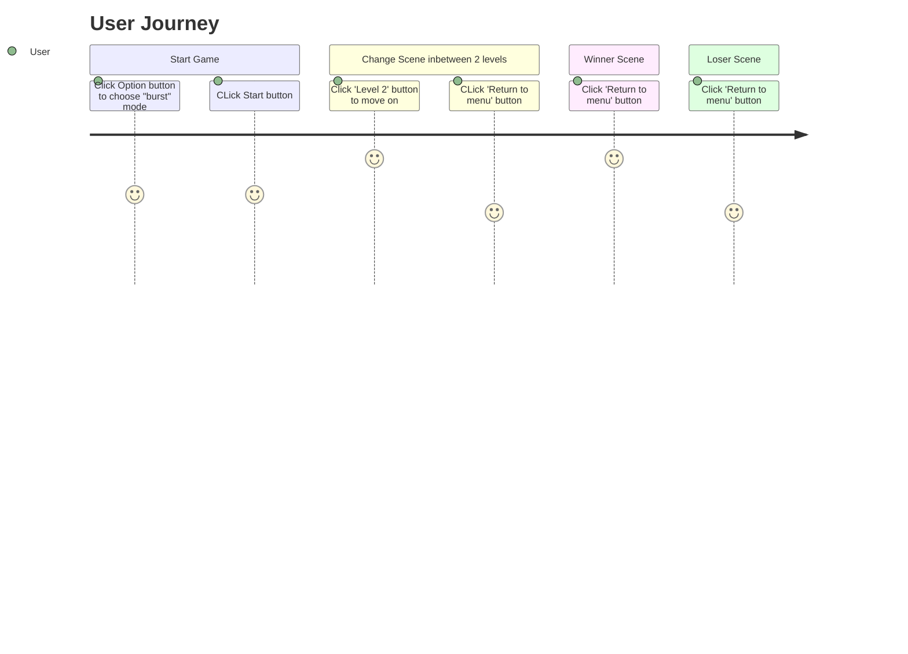
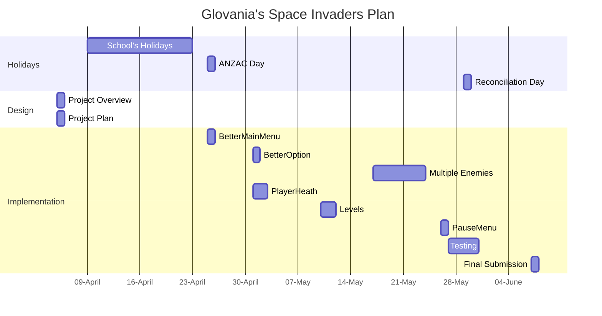

# Project Overview

- This game is a Upgraded version of "Space Invaders". The game's theme is The Outsiders vs The Belongings.

- The Outsiders are alliens that invading our planet. The Belongings are human that trying their best to protect their planet. 

# New Gameplay

- In this new gameplay for "Space Invader, we will have a total of 2 levels. In Level 1, there will be an enemy called "Space" for you to defeat. Similar in level 2, however, there will be a new enemy called "Arrow". The only way to win this game is to defeat all the enemies on both level within the limited time.

## New Level

- We will have 2 levels in this game.
## Multiple Enemy Types
        
- On level 2, we will have a new type of enemy called "Arrow" enemies.

    

## Player's Health

- Player will have at least 3 health.

    

 
# Behaviour - User Journey

# Planning Diagram - Project Plan

