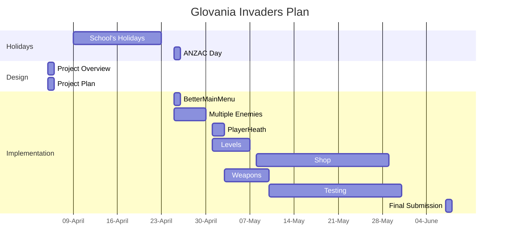

# Project Overview

This game is a Upgraded version of "Space Invaders". The game's theme is The Outsiders vs The Belongings.

The Outsiders are alliens that invading our planet. The Belongings are human that trying their best to protect their planet. 

# New Gameplay

For the updated gameplay, first of all, I'm adding new player weapons

## Player Weapons

Player will get a new weapon after every 2 levels. The new weapons will be Laser, Gas bombs and Vines. However, for each weapon, they will be restricted as can be shooted only 3 shots/ click. With Laser weapon type, they will be infinite with a delay of 5 seconds.

## Multiple Enemy Types
        
The higher the level is, the more complicated enemy are. For instance, in level 2, instead of having only "Gunner" enemies where they can only shoot and shuffle down, there will be a new enemy called "Tracker". "Tracker" will shoot out arrow that track player movement (Not too accurate). For player to deflect it, they can either dodge it or shoot down the arrow.

 

 
# Behaviour - User Journey

# Planning Diagram - Project Plan

