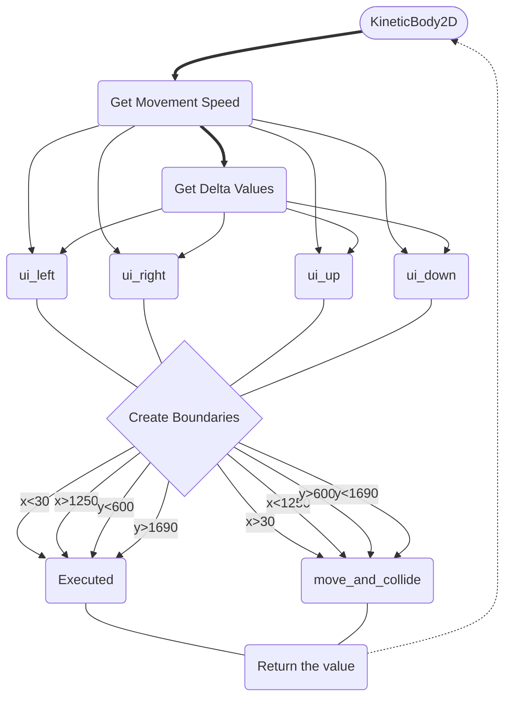

# Logic

## Movement system
### Player Movement

### Enemy Movement

## Bullets system
### Enemy Bullets

### Player Bullets

### Automatic Firing

## Health system

### Player's Heath

### Enemy's Health

## UIs

### Levels system

### Win Scene

### Lose Scene
### Highsccore system

### Scene changes system

### Pause Menu

## Killed/Executed system

### Kill Player

### Kill Enemy
