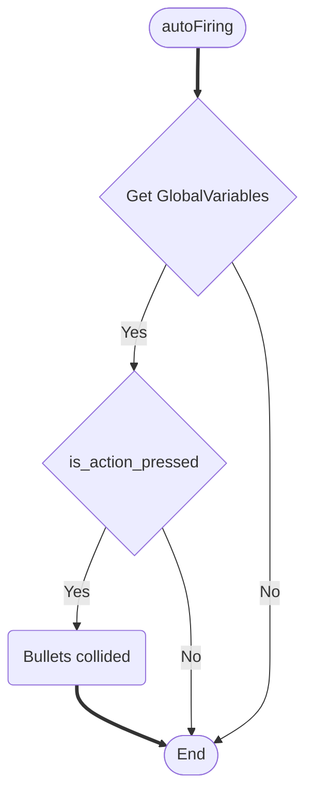
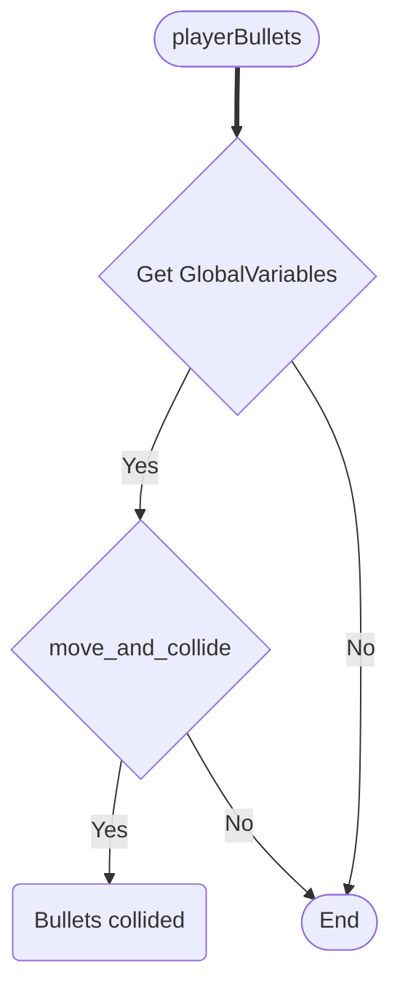
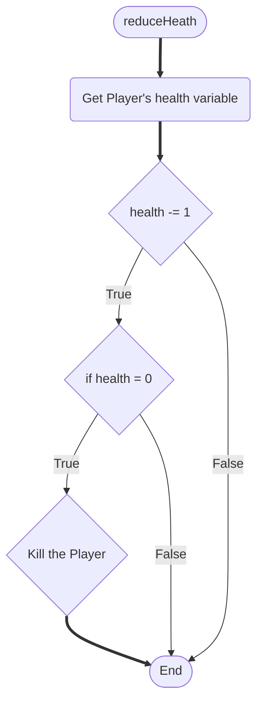
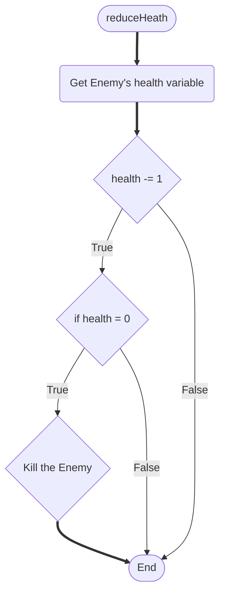

# Logic

## Movement system
### Player Movement
```mermaid
flowchart TD
%% Comment
    Start([playerMovement])
    End([End])

    xPosition_1{position.x > 30}
    xPosition_2{position.x < 1250}

    yPosition_1{position.y < 1690}
    yPosition_2{position.y > 600}

    movePlayer_1{move_and_collide}
    movePlayer_2{move_and_collide}
    movePlayer_3{move_and_collide}
    movePlayer_4{move_and_collide}

    GetLeftUI{ui_left}
    GetRightUI{ui_right}
    GetUpUI{ui_up}
    GetDownUI{ui_down}


    Start ==> GetLeftUI


    GetLeftUI -->|Yes| xPosition_1
    xPosition_1 -->|Yes| movePlayer_1


        movePlayer_1 ==> GetRightUI
        GetLeftUI ==> |No| GetRightUI
        xPosition_1 ==> |No| GetRightUI


        GetRightUI --> |Yes| xPosition_2
        xPosition_2 --> |Yes| movePlayer_2


            movePlayer_2 ==> GetDownUI
            GetRightUI ==> |No| GetDownUI
            xPosition_2 ==> |No| GetDownUI


            GetDownUI --> |Yes| yPosition_1
            yPosition_1 --> |Yes| movePlayer_3


                movePlayer_3 ==> GetUpUI
                GetDownUI ==>|No| GetUpUI
                yPosition_1 ==> |No| GetUpUI


                GetUpUI --> |Yes| yPosition_2
                yPosition_2 --> |Yes| movePlayer_4


                    movePlayer_4 ==> End
                    GetUpUI ==>|No| End
                    yPosition_2 ==> |No| End
 ```

### Enemy Movement
```mermaid
flowchart TD
%% Comment
    Start([enemyMovement])
    End([End])
    xGlobalPosition{global_position.x}
    EnemyMovementActivate(move and collide the enemy)


    Start ==> xGlobalPosition 

    xGlobalPosition --> |True| EnemyMovementActivate
    xGlobalPosition --> |False| End
```

## Bullets system

### Automatic Firing

### Enemy Bullets

### Player Bullets


## Health system

### Player's Heath

### Enemy's Health
