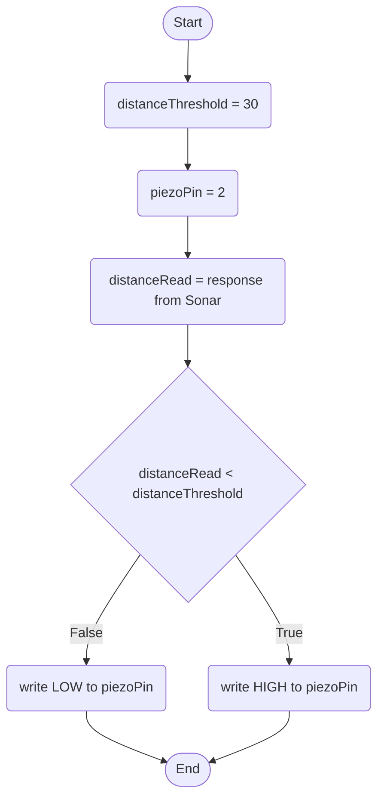

# This is just an example of a flowchart logic. Working on the actual logics later on :D

```mermaid
flowchart TD
     terminalStart([Start])
    %% Comment
    terminalEnd([End])
    thresholdSet(distanceThreshold = 30)
    setPiezoPin(piezoPin = 2)
    currentDistanceReading(distanceRead = response from Sonar)
    activatePiezo(write HIGH to piezoPin)
    deactivatePiezo(write LOW to piezoPin)

    ifDistanceLessThanThreshold{distanceRead < distanceThreshold}

    terminalStart --> thresholdSet
    thresholdSet --> setPiezoPin
    setPiezoPin --> currentDistanceReading
    currentDistanceReading --> ifDistanceLessThanThreshold
    ifDistanceLessThanThreshold --> |True| activatePiezo
    ifDistanceLessThanThreshold --> |False| deactivatePiezo
    deactivatePiezo --> terminalEnd
    activatePiezo --> terminalEnd
```